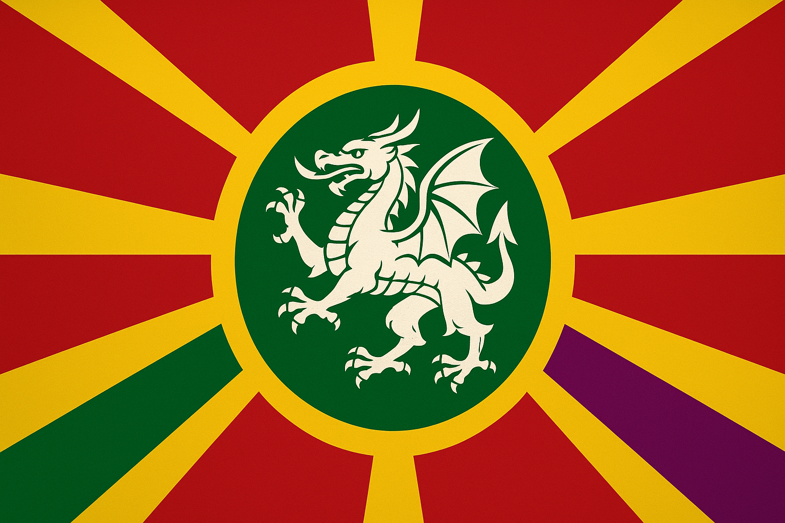

## **Introduction**

### **At a Glance**

| Category                   | Information                                           |
| -------------------------- | ----------------------------------------------------- |
| **Capital City**           | Draceis Montis                                        |
| **Languages**              | Draconic(official within dragons), common(Mortals)    |
| **Currency**               | **Kelaric Draken** _(ɌD)_                             |
| **Calendar**               | Draconic Calendar                                     |
| **Existence as a Kingdom** | Over 250 years                                        |
| **Religion**               | Draconic Truth, Other religions                       |
| **Population of Ka**       | "Kelarian" ~172 million                               |
| **Size**                   | ~7.9 million km²                                      |
| **System of Rule**         | Dracocratic Monarchy                                  |
| **Law Enforcement**        | Split Law enforcement depending on Mortals or Dragons |
| **Military Ranking**       | Rank 7                                                |
| **Wealth Ranking**         | Rank 8                                                |

**Kelar** is the youngest nation in Omain, founded in **1223 A.H.** after the draconic clans of the Kelarian Mountains repelled an Erulian siege on the stronghold of **Draceis Montis**. The defeat marked the first recorded failure of an Erulian invasion against draconic territory and directly led to the establishment of Kelar as a sovereign state.

The region is steeped in **draconic ancestry**, with many inhabitants descending from ancient dragons and dragonborn bloodlines. Unlike most nations shaped by human dynasties, Kelar’s society centers on **draconic heritage, lineage, and ancient oaths**, rather than cultural assimilation or conquest. Vast portions of the **Kelarian and Western Draconic Mountains** are considered sacred ancestral lands, believed to hold primordial lairs, burial sites, and spiritual nexuses tied to the origins of dragon-kind.

## **Origins and Foundations**

**Kelar** is the youngest sovereign nation in Omain, founded in **1223 A.H.** in the aftermath of the failed Erulian siege of **Draceis Montis**, a fortified draconic settlement located deep within the Kelarian Mountains. Prior to its formation, the region was contested highland territory largely ungoverned by external powers, though nominally claimed by the Erulian Empire.

The attempted siege marked a turning point in the relationship between draconic clans and the Empire. The assault was repelled decisively by dragon forces, prompting the dragons to formally declare the mountain range and surrounding territories **a sovereign state established for their own protection and autonomy**.

Following the declaration, the dragons expanded their claim beyond the core mountain region to include **the Western Draconic Mountains**, a major range situated between **Thaxted** and **Hatland**. These territories were consolidated under the new nation and recognized as **the ancestral domain of draconic lineage**.

To solidify governance and establish diplomatic legitimacy, the draconic clans appointed a **dragonborn ruler** to lead the nation, creating a monarchy rooted in draconic heritage rather than human noble lineage. Modern Kelar remains culturally dominated by descendants of dragons and dragon-kind hybrids, with governance, symbolism, and society heavily shaped by ancient draconic traditions.

Today, Kelar is defined by:

- **Draconic ancestry and bloodlines**
- **Mountain-based settlements and high-altitude fortresses**
- **A political foundation built from resistance to the Erulian Empire**
- **Territorial claims spanning multiple mountain ranges**

Despite its youth as a political entity, Kelar commands significant strategic power due to its geography, its draconic population, and its origin as a nation formed in direct defiance of imperial expansion.

## **Geography/Borders**

Kelar spans a vast mountainous region across both major continents, with territory defined primarily by ancestral draconic land claims rather than conventional political boundaries. Its geography is dominated by high-altitude terrain, volcanic ridges, glacial lakes, and steep natural fortifications that make foreign invasion or occupation extremely difficult.

Although officially recognized as a single sovereign nation, Kelar's landholdings are **non-contiguous**, reflecting the fragmented nature of ancient draconic domains across both **Droskarin** and **Virelya**.

---

### **1. Borders**

Kelar’s territorial claims extend across two continents:

#### **📍 Droskarin Borders**

- **North:** Kingdom of Ka & Erulian Empire
- **West:** Chilborkia
- **South:** Helskirk
- **Northwest:** Small coastal territory on the **Shersian Channel**
- **South:** A narrow stretch of coastline on the **Grand Southern Ocean**

These regions form the heart of Kelar’s draconic settlements and contain the capital site, Draceis Montis.

---

#### **📍 Virelya Borders**

Through ancestral territorial rights over the Western Draconic Mountains, Kelar also borders:

- **West:** Thaxted
- **East:** Hatland

These western mountain claims are internationally disputed but largely uncontested militarily due to the region’s inhospitable terrain and draconic patrols.

---

### **2. Major Geographical Features**

| Landmark                                 | Description                                                                                                                                                                        |
| ---------------------------------------- | ---------------------------------------------------------------------------------------------------------------------------------------------------------------------------------- |
| **Kelarian Mountains**                   | The dominant terrain of Kelar; vast twin mountain systems spanning both continents. Home to ancient draconic lairs, fortresses, and high-altitude settlements.                     |
| **Western Draconic Mountains**           | A sub-range located between Thaxted and Hatland in Virelya; considered ancestral draconic territory and a sacred region.                                                           |
| **Draceis Montis**                       | Mountain stronghold and spiritual capital of the dragon clans; birthplace of Kelar as a nation.                                                                                    |
| **Frozen Lakes of the Kelarian Range**   | High-elevation glacial lake clusters known for permanent ice layers, magical properties, and draconic pilgrimage routes.                                                           |
| **Tetford’s Peak**                       | _Height: 6,924 meters_ — the tallest mountain on Omain, located within Kelar territory in the western range. A sacred geological monument tied to ancient draconic creation myths. |
| **Metal Valleys (Bordering Chilborkia)** | Kelar controls a small eastern sector of the mineral-rich valleys extending from Chilborkia, used for forging draconic alloys and ritual armaments.                                |

---

### **3. Geographic Identity**

Kelar’s geography shapes nearly all aspects of its society:

- **Mountain strongholds instead of cities**
- **Fortress-paths and flight corridors rather than roads**
- **Population concentrated in high-altitude settlements**
- **Natural barriers acting as border walls**
- **Territory defined by ancestral claims rather than straight borders**

The nation’s geography reinforces its origins as a defensive refuge for ancient dragons rather than a conventional expansionist state.

## **Politics & Factions**

Kelar operates under a unique political structure that blends monarchy with ancient draconic governance. Rather than exercising full sovereign authority, the reigning monarch functions primarily as a **representative of draconic will**, acting on behalf of the ancient dragons who founded the nation. True political power resides with the **Draconic Covenant**, an ancestral council of elder dragons who determine the kingdom’s long-term direction.

Kelar’s government emphasizes ancestral duty, stewardship of draconic lands, and preservation of bloodline heritage over territorial expansion or human-centered rule.

---

### **1. The Monarchy**

Kelar has a **draconic monarchy**, but unlike human dynasties in other nations, rulers are not selected by birthright alone. Instead, **monarchs are appointed by the Draconic Covenant**, chosen based on lineage, worthiness, and capacity to serve as intermediary between dragons and mortals.

#### **Role of the Monarch**

- Represents the Covenant to the mortal population
- Oversees daily governance and civilian policy
- May enact minor reforms without approval
- Must seek Covenant authorization for major laws, wars, treaties, or territorial claims

The monarchy is a **position of stewardship**, not ultimate authority.

#### **Current Monarch**

- **Uhtred Ragnar** — Acting monarch
- Succeeded his fallen brother, **Hrodbert Ragnar**, who died in battle
- Temporary ruler until the true heir comes of age

#### **Successor**

- **Torsten Ragnar**, age 10
- Next legitimate monarch, but cannot ascend until age **20**
- His sister, **Mira Ragnar**, is politically influential but not first in succession

Until Torsten matures, Uhtred serves as **Regent Monarch**.

---

### **2. The Draconic Covenant**

The **Draconic Covenant** is the supreme governing body of Kelar, composed of elder dragons representing ancient bloodlines and territorial domains. They possess ultimate decision-making authority, guided by ancestral precedent and long-term preservation of draconic interests.

| Position                   | Name                         | Role                                                      | Residence                              |
| -------------------------- | ---------------------------- | --------------------------------------------------------- | -------------------------------------- |
| **Mother of the Covenant** | _Vaelthyria the Dawn-Wing_   | Spiritual matriarch, presides over ascension and prophecy | Draceis Montis                         |
| **Father of the Covenant** | _Drakarion the World-Forger_ | Final arbiter of national fate; guardian of ancient oaths | **Aerwyrm Hold** _(Western Mountains)_ |

#### **Council of Five Elder Dragons**

| Name                            | Role                                                           | Region         |
| ------------------------------- | -------------------------------------------------------------- | -------------- |
| **Zythor Ember-Maw**            | Keeper of Martial Tradition & War                              | Draceis Montis |
| **Seraphelis the Frost-Veiled** | Guardian of Glacial Lakes & Northern Peaks                     | Draceis Montis |
| **Thalavor Stone-Vein**         | Protector of Mountain Mines & Metal Valleys                    | Draceis Montis |
| **Kharox the Sky-Breaker**      | Overseer of flight routes, mountain passes, and aerial borders | Aerwyrm Hold   |
| **Myrienn Ash-Spiral**          | Archivist of ancestry, history, and draconic oaths             | Aerwyrm Hold   |

**Draceis Montis** houses the main Covenant, while a secondary seat exists in the Western Draconic Mountains at:

### **Aerwyrm Hold**

A high-altitude settlement carved into volcanic basalt, home to the Father and two council members. It serves as the western authority over draconic domains in Virelya.

---

### **3. Distribution of Power**

| Authority                | Scope                                            | Limits                                                |
| ------------------------ | ------------------------------------------------ | ----------------------------------------------------- |
| **Covenant (Dragons)**   | Strategy, religion, land rights, war, prophecy   | Do not manage daily governance                        |
| **Monarch (Dragonborn)** | Administration, law, diplomacy, civic leadership | Cannot make major decisions without Covenant sanction |
| **Clans & Nobles**       | Regional governance, mountain stewardship        | Must obey Covenant decrees and oaths                  |
| **Military Chiefs**      | Battlefield command                              | Cannot declare war or hold territory without approval |

This results in a stable but highly centralized spiritual power structure.

---

### **4. Political Factions**

| Faction                        | Goal                                           | Support Base                              |
| ------------------------------ | ---------------------------------------------- | ----------------------------------------- |
| **Covenant Loyalists**         | Maintain dragon-first governance               | Dragonborn elites, priests, ancient clans |
| **Human Ascensionists**        | Desire more power for mortals and monarch      | Lowland settlers, traders                 |
| **Western Autonomists**        | Want Aerwyrm Hold to act independently         | Virelyan-side mountain clans              |
| **Imperial Accommodationists** | Seek normalized relations with Erulia          | Merchants, diplomats                      |
| **Ancestral Purists**          | Reject monarchy; want dragons to rule directly | Radical draconic cults                    |

Most factions currently remain dormant, awaiting Torsten’s rise.

---

### **5. Current Political Climate**

With the heir still a child and Uhtred serving as an interim monarch, Kelar is in a **state of suspended transition**. Power remains stable due to Covenant oversight, but:

- human nobles push for more political autonomy
- dragons remain cautious after the Empire’s past aggression
- western territories grow more independent due to geographic separation

The succession of Torsten Ragnar is expected to either unify the realm or trigger ideological reform.

## **Culture**

The culture of **Kelar** is deeply rooted in ancient draconic ancestry, shaped by millennia of dragon presence in the Kelarian and Western Draconic Mountains. While the population outside the mountain regions is diverse and multicultural, Kelarian identity is defined by reverence for draconic lineage, ancestral land claims, and the preservation of long-lived knowledge rather than conquest or imperial assimilation.

Kelar is a kingdom built _around_ dragons, not _for_ them; the draconic presence is spiritual, ancestral, and advisory rather than authoritarian.

---

### **1. Population and Identity**

Although dragons and dragonborn form the cultural core of Kelar, most inhabitants are **not draconic by blood**. Instead, cultural identity is shared through:

- adoption of draconic clan banners
- participation in mountain rites
- respect for long-term ancestry and memory
- integration into settlements formed in the mountain footholds

Outside the mountains, Kelar functions as a **multicultural society**, with major cities hosting humans, dwarves, hybrids, nomads, and foreign residents.

#### **Dornhilm — The Facade Capital**

Because access to **Draceis Montis** is restricted—only dragons, dragonborn, and sanctioned envoys may enter—the majority of cultural, political, and economic life for non-draconic citizens happens in **Dornhilm**, a major lowland hub commonly mistaken as the capital by outsiders.

It serves as:

- the seat of trade and diplomacy
- the public face of the nation
- cultural fusion between foreign and draconic influence

This dual-capital dynamic defines Kelar’s identity: a realm ruled from sacred mountains but lived in across plains and valleys.

---

### **2. Draconic Cultural Foundations**

Kelar’s culture is built upon ancient draconic principles:

| Value                     | Cultural Meaning                                    |
| ------------------------- | --------------------------------------------------- |
| **Longevity**             | Decisions are made to affect centuries, not decades |
| **Memory**                | History is carried in lineage, not written law      |
| **Territory as Heritage** | Land is sacred, not political territory             |
| **Wisdom Over Power**     | Dragons teach; they do not command by force         |

Even non-dragonborn Kelarians often adopt these values as cultural ideals.

---

### **3. Religion: The Draconic Truth**

The primary faith of Kelar is called **Draconic Truth**, but unlike most organized religions, it is _not doctrinal_ and _not enforced_. It is a **philosophical tradition of knowledge-keeping**, not a system of worship.

#### **Core Concepts**

- Dragons share recorded knowledge accumulated over millennia
- Teachings are stored in scroll vaults, stone tablets, and oral records
- Followers seek wisdom and ancestral understanding, not salvation
- Truth is something _learned_, not _revealed_

#### **Not a Mandated Faith**

- Dragons may participate or ignore it entirely
- Citizens are free to follow or reject it
- There is no clergy, only scribes and archivists
- No heresy, no conversion, no spiritual punishment

This reflects Kelar’s foundational belief that **knowledge is a gift, not a commandment**.

---

### **4. Cultural Expression**

Kelar’s artistic and social traditions center on mountain symbolism and ancestral reverence:

- stonework carvings of bloodlines and flight paths
- murals depicting ancient dragon forms and migrations
- architecture built from basalt, obsidian, and volcanic stone
- ceremonial pyres and air-flow rituals on high peaks
- songs sung in deep resonant tones meant to echo through caverns

Art rarely glorifies war—it glorifies endurance, age, and memory.

---

### **5. Social Hierarchy and Clans**

Kelar lacks rigid class systems; instead, society is structured by **clans linked to draconic bloodlines**. A person may join a clan through:

- birthright
- earned oath
- ancestral claim
- initiation through service

Clans control territories, not governments. The monarch unites them through Covenant approval.

---

### **6. Cultural Values**

| Value                    | Description                                        |
| ------------------------ | -------------------------------------------------- |
| **Endurance**            | Strength measured by how long one’s legacy lasts   |
| **Wisdom Before Action** | Recklessness is culturally scorned                 |
| **Guardianship**         | Protection of land and people as divine duty       |
| **Ancestral Loyalty**    | Obligations to lineage outweigh national law       |
| **Stoicism**             | Public emotional restraint is considered honorable |

Where Ka honors freedom and survival, and Erule honors divine destiny, Kelar honors _memory and time_.

---

### **7. Cultural Tensions**

Despite unity under draconic legacy, tensions exist:

- **Mountain vs Lowland Identity** — dragonborn elites vs multicultural majority
- **Knowledge Keepers vs Warriors** — truth seekers vs young militarists
- **Isolationists vs Integrators** — those who want to remain sacred and hidden vs those seeking global engagement

These tensions will intensify when Torsten reaches adulthood and begins shaping policy.

---

### **Summary**

Kelar is a culture of ancestry, mountain sanctity, and draconic wisdom. It is a nation defined not by conquest or doctrine, but by preservation—of land, memory, and identity spanning eras beyond human history.

## **Laws & Taboos**

Kelar’s legal structure is built upon a dual system that reflects its mixed population and draconic heritage. While most residents are subject to a standardized civil justice system, individuals of **draconic blood**—including dragons and dragonborn—are governed by ancient ancestral law originating in the high peaks of the Kelarian Mountains.

This split system exists not to separate citizens by value, but to honor draconic tradition and the belief that dragons bear responsibility not to the kingdom, but to **ancestral oaths and their own lineage**.

---

### **1. Civil Law (Applies to Non-Draconic Citizens)**

Non-draconic residents—including humans, dwarves, migrants, hybrids, and foreigners—are tried under a formal civic legal system based on **fair trial, evidence, and restitution.**

#### **Core Principles**

- All accused receive a trial and defense
- Crimes are judged by civil courts in major cities
- Punishments prioritize restoration, not spectacle
- Public executions are forbidden
- Execution occurs only in extreme cases and privately

#### **Common Penalties**

| Crime Type                    | Consequences                                       |
| ----------------------------- | -------------------------------------------------- |
| Theft, fraud, property crimes | Fines, restitution, labor service                  |
| Violent crimes                | Imprisonment or exile                              |
| Murder, treason, mass harm    | Silent execution or lifelong mountain imprisonment |

The purpose of civil law is harmony and balance, not fear.

---

### **2. Draconic Law (Applies to Dragons & Dragonborn)**

Dragons and dragonborn are bound not to civil authority, but to ancient ancestral obligations. Their crimes are judged in the mountains, under the oversight of **the Draconic Covenant** and elders of their bloodline.

These laws are spiritual and ceremonial rather than bureaucratic; criminality is defined as betrayal of **oath, lineage, or ancestral responsibility.**

#### **Where Trials Occur**

All trials for draconic-blooded individuals take place in sacred sites such as:

- **The Peaks of Judgement** near Draceis Montis
- **The Arena of Chains** (primary trial arena)
- secluded caverns dedicated to specific clans

#### **Typical Charges Under Draconic Law**

- abandonment of ancestral duty
- betrayal of a blood-oath
- endangering sacred lands
- disrupting lineage heritage
- killing another draconic kin without cause

These may not be crimes under civil law but are considered grave violations of draconic existence.

---

### **3. Ritual Trial by Combat ("The Arena")**

For dragons and dragonborn, punishment is centered on redemption rather than punishment. Accused individuals undergo **trial by combat**, not for entertainment, but as a spiritual test of:

- commitment to ancestry
- willingness to atone
- strength to reclaim honor

#### **Outcomes of Arena Trials**

| Outcome                | Meaning                                                   |
| ---------------------- | --------------------------------------------------------- |
| **Victory**            | Offense forgiven; oath renewed                            |
| **Defeat, Submission** | Exile, loss of clan standing, or forced penance           |
| **Death**              | Considered an honorable resolution; lineage ends cleansed |

If the crime is severe enough, the accused may be forced to fight **multiple opponents** or **a chosen ancestral champion.**

Trials are witnessed only by dragons and sworn dragonborn—never outsiders.

---

### **4. Legal Tiers and Jurisdiction**

| Group                    | Judged By              | Authority           |
| ------------------------ | ---------------------- | ------------------- |
| Mortals & mixed citizens | Civil courts           | Magistrates, judges |
| Dragonborn               | Clan elders & Covenant | Draconic law        |
| Dragons                  | Covenant only          | Ancestral authority |

This system prevents mortals from ruling over dragons and ensures dragons do not impose ancient law on unrelated citizens.

---

### **5. Taboos in Kelarian Culture**

Not all violations are criminal; many are cultural taboos tied to sacred tradition:

| Taboo                                                 | Reason                                 |
| ----------------------------------------------------- | -------------------------------------- |
| Entering Draceis Montis without sanction              | Considered spiritual trespass          |
| Defacing mountains or ancestral caverns               | Seen as defilement of draconic lineage |
| Forging weapons in ancestral metals without blessing  | Sacred minerals are not mere resources |
| Publicly claiming draconic blood falsely              | Considered identity theft              |
| Killing a dragonborn challenger outside ritual combat | Violates ancestral trial customs       |

Breaking taboos often leads to exile rather than legal punishment, especially for mixed-heritage citizens.

---

### **6. Philosophy of Kelarian Justice**

Where civil law seeks **order and repair**, draconic law seeks **redemption and legacy**. Justice in Kelar is built on two foundational beliefs:

- **Mortals must live together in harmony.**
- **Dragons must uphold their lineage beyond mortal time.**

This duality preserves balance between ancient wisdom and a living, multicultural population.

## **Timeline**

Wars, tensions, treaties, crises, or events the party could get dragged into.

## **Military of the Kingdom of Kelar (Uhtredic Reforms)**

Under the regency of **Uhtred Ragnar**, Kelar’s military has undergone a structured reorganization aimed at strengthening the kingdom’s defensive capability while maintaining its long-standing policy of non-aggression. Uhtred’s doctrine emphasizes **discipline, coordinated regiments, and optimized battlefield roles** rather than brute force or expansionism.

Kelar still avoids war whenever possible, but if conflict arises, the military is now prepared for rapid, tactical, and layered defense. The rest of the world views Uhtred’s restructuring as Kelar’s shift toward **strategic readiness**, not militarization.

---

### **I. Ground Forces Overview**

Uhtred’s ground military is divided into **four primary regiments**, each designed to complement the others in a unified battle strategy:

1. **Fortification Regiment**
2. **Close Quarters Regiment**
3. **Fast Attack Regiment**
4. **Archery Regiment**

Together, these four units form a **cyclical combat system** of shield, spear, strike, and support—designed to withstand sieges, break enemy lines, and exploit weaknesses with precision.

### **1. Fortification Regiment**

#### _“The Shield of Kelar”_

The largest of all regiments, the Fortification forces form the backbone of Kelar’s defensive strategy. Uhtred expanded this regiment significantly, believing that Kelar’s greatest strength lies in **endurance and terrain**, not aggression.

#### **Primary Roles**

- **Counter-siege warfare** against enemy engines and artillery
- **Shield-wall formation** forming the first defensive line
- **Blockades** to choke enemy advance through mountain passes
- **Rapid construction of cover**, barricades, and emergency fortifications
- **Filling structural gaps** created by siege weaponry

#### **Combat Style**

Fortification troops are heavily armored and trained to endure prolonged engagements. They advance slowly and deliberately, absorbing enemy pressure while other regiments maneuver behind them.

They are the **first in, last out**, and their discipline is unmatched.

---

### **2. Close Quarters Regiment**

#### _“The Spear of Kelar”_

If Fortification is the shield, **Close Quarters** is the spear that strikes behind it. This regiment consists of Kelar’s fiercest melee specialists and is second only to the archers in size.

#### **Internal Divisions**

- **Dual-Wielders** — fast, aggressive frontline breakers
- **Weapon + Shield Fighters** — defensive duelists ideal for narrow terrain
- **Single-Weapon Specialists** — high precision, trained for rapid kill strikes
- **Berserkers** — extremely rare, used _only_ in last-resort situations

#### **Dual Role**

1. **Primary combat regiment**, performing the bulk of hand-to-hand fighting
2. **Military instructors** who train all other regiments in:

   - sword, axe, hammer, and club combat
   - striking vital points
   - close-range maneuvering
   - maintaining discipline in melee

The Close Quarters regiment forms Kelar’s **killing edge**, advancing when Fortification opens a breach.

---

### **3. Fast Attack Regiment**

#### _“The Wind of Kelar”_

This is Kelar’s smallest but most elite regiment, inspired by the fast-strike tactics of ancient mounted tribes. They function as **rapid shock units**, specializing in hit-and-run warfare.

#### **Composition**

- Exclusively composed of **the fastest dragonborn**, selected for agility and endurance
- Equipped with **light armor** to maximize speed
- Trained to operate independently or in pairs

#### **Combat Style**

- **In, strike, out** — never holding ground longer than a heartbeat
- **Flanking attacks** that collapse enemy sides
- **Drive-by slashing** as they pass through exposed weaknesses
- **Harassing retreating forces**

Their job is not to break the enemy but to **destroy their cohesion**, causing confusion and panic.

---

### **4. Archery Regiment**

#### _“The Rain of Kelar”_

The archers provide ranged superiority and battlefield control. They are similar in number to the Close Quarters regiment and operate closely with both Fortification and Fast Attack units.

#### **Primary Roles**

- Fire volleys **behind Fortification blockades**
- Target key enemy assets before melee begins
- Disorient and thin advancing formations
- Work alongside Fast Attack units to finish unshielded survivors

#### **Supply Structure**

The Archery Regiment includes:

- **Primaries:** trained bowmen
- **Range-Runners:** members whose sole duty is to maintain arrow supply, keep quivers filled, and retrieve spent ammunition

Archers are the **first force to inflict damage** and the ones who decide the shape of the battle.

---

### **Unified Battle Doctrine**

Uhtred’s reforms created a **rotational battlefield system**, each regiment supporting the others:

1. **Fortification** establishes the defensive front.
2. **Archers** weaken and disorient the enemy.
3. **Close Quarters** strikes decisively once the enemy is destabilized.
4. **Fast Attack** flanks, harasses, and eliminates fleeing or exposed units.

This system ensures Kelar can:

- Hold ground indefinitely
- Punish aggressive enemies
- Win battles without needing large armies
- Maintain defensive supremacy without offensive ambition

---

### **Kelar’s Air Force**

Although not part of the four ground regiments, Kelar’s greatest advantage remains the **dragon air force**, used only under Covenant decree. Dragons have **no ranks** and fight according to age, lineage, and ancestral instinct, acting as:

- aerial siege breakers
- scouts
- shock support
- guardians of sacred mountains

They remain Kelar’s ultimate deterrent—rare to deploy, devastating when used.

## **Notable figures**

Great people of the country.
