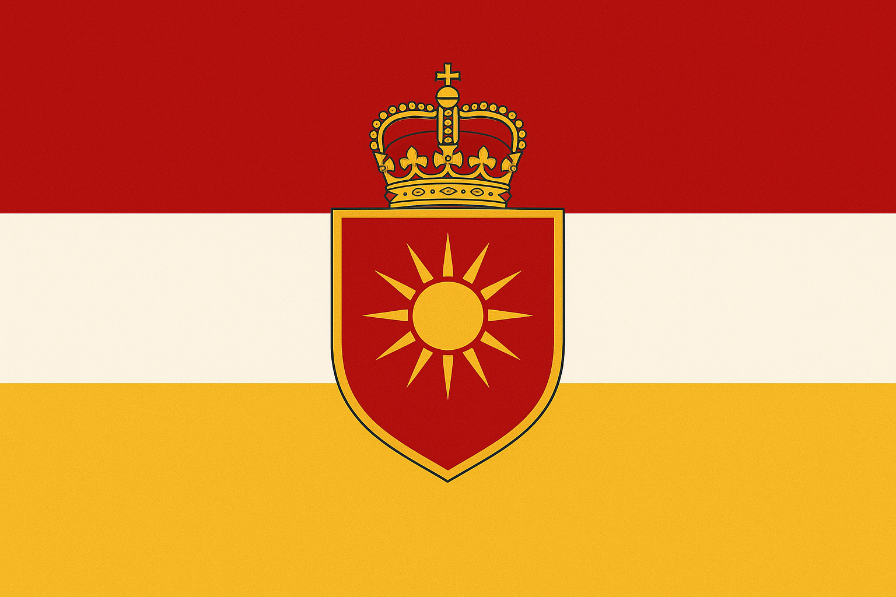

import DynamicBreadcrumb from "../../../../components/DynamicBreadcrumb.astro";

<DynamicBreadcrumb />

## **Introduction**

(_Flag of the Erulian Empire_)

The **Erulian Empire** is the largest and oldest known political state in Omain, encompassing **19.0 million square kilometers** including its mainland territory on Droskarin and full control of the Shersian Archipelago. Originating from the tribal human culture of the **Erulians** in the region now known as **Erule**, the Empire has historically served as the dominant cultural, political, and religious force across the world.

### **At a Glance**

| Category                      | Information                                        |
| ----------------------------- | -------------------------------------------------- |
| **Capital City**              | _Erule_                                            |
| **Languages**                 | Erulian (official), Common                         |
| **Currency**                  | _Hexic Crown_ (ɌH)                                 |
| **Calendar System**           | Erulian Calendar                                   |
| **Existence**                 | Over **1,500 years**                               |
| **Religion (State & Origin)** | Hexadem                                            |
| **Global Population**         | ~1.42 billion                                      |
| **Population of Empire**      | "Erulian" ~441 million (~31% of global population) |
| **Total Size**                | 19.0 million km²                                   |
| **System of Rule**            | Absolute Monarchy                                  |
| **Current Ruler**             | Empress Erolith I                                  |
| **Law Enforcement**           | Centralized imperial courts, trial-based justice   |
| **Military Power Ranking**    | #1 globally                                        |
| **Wealth Ranking**            | #2 globally                                        |

## **Origins and Foundations**

The empire was founded by **Emperor Calados I** in **Year 0 of the Erulian Calendar**, an event marking the formal establishment of the empire, the creation of the **Hexadem religion**, and the introduction of the first recorded timekeeping system in Omain. The Erulian Calendar divides history into:

- **A.H. — After Hexadem** (from Year 0 onward)
- **B.H. — Before Hexadem** (dates prior to the empire’s founding)

Originally composed solely of the Erulian human tribe, the empire gradually expanded through conquest, colonization, religious influence, and integration, eventually evolving into a **multicultural imperial state** incorporating races, cultures, and regions beyond its homeland.

Throughout its history, the Erulian Empire has exerted control over vast regions of Omain, including large parts of both major continents. Its influence shaped global religion, language, trade, war, and governance. The empire is widely regarded as the primary architect of recorded world history and the standard-setter for calendars, diplomacy, and organized religion.

Although its land holdings have diminished significantly from their height, many nations trace cultural or historical roots back to Erulian rule.

## **Geography/Borders**

The mainland territory of the Erulian Empire is located on **Droskarin**, bordered by:

| Neighboring Region     | Direction |
| ---------------------- | --------- |
| **<a href="/locations/countries/kingdom-of-ka">Kingdom of Ka</a>**      | West      |
| **Kingdom of Kelar**   | South     |
| **Helskirk**           | South     |
| **Permatesh**          | North     |
| **Terra Fina Channel** | East      |

In addition to continental borders, the empire **fully governs the Shersian Archipelago**, located between the Eastern and Western continents.

- **Mainland area:** 17.9 million km²
- **Shersian Archipelago:** 1.1 million km²
- **Total territory:** 19.0 million km²

Imperial naval infrastructure extends across both hemispheres and controls key maritime routes through the central channels of Omain.

Several major natural landmarks are located within or along the borders of the empire:

#### **Dead Man’s Lake**

Located on the border between Erule and the <a href="/locations/countries/kingdom-of-ka">Kingdom of Ka</a>. Named due to its long history as a battlefield and strategic conflict zone.

#### **Erulian Desert**

A vast desert east of the imperial heartland, extending into the foothills of the Western Draconic Mountains. Notable for its rare seasonal snowfall caused by elevation and wind patterns from the mountains.

#### **Erulian Plains**

An extensive grassland region covering much of the empire’s agricultural core. These plains served as the homeland of early Erulian tribes and later became the foundation of imperial expansion.

## **Politics & Factions**

### **Overview**

The **Erulian Empire** is governed by an **absolute monarchy**, the oldest and most stable ruling institution on Omain. Since its founding in **0 A.H.** by **King Calados I**, the Imperial Crown has passed **unbroken** through the **Aquabrand bloodline**, making it the **longest continuous hereditary lineage** in recorded world history.

Political authority in the empire is characterized by an intricate balance between the **imperial throne** and the **Hexadem**, the state religion. While the emperor or empress wields ultimate authority in all matters of state, law, and military force, their decisions are traditionally shaped—and at times constrained—by the interpretations and demands of the Hexademic clergy.

---

### **The Imperial Lineage**

The Erulian political structure revolves entirely around the sanctity of the **Aquabrand bloodline**.

- The **Crown of Erule** is spiritually and legally bound to the **House Aquabrand**, the founding dynasty.
    
- The **Hexadem explicitly forbids** any individual outside the Aquabrand bloodline from taking the throne.
    
- This rule has never been violated, and no foreign or non-Aquabrand ruler has ever held power in the empire.
    

This absolute restriction has fortified the political identity of Erule for over **1,500 years**, shaping its culture around dynastic continuity and divine legitimacy.

---

### **The Monarch**

#### **Authority**

The sitting monarch is the **undisputed supreme authority** within the empire:

- Commands the military
    
- Dictates law
    
- Oversees all regional governance
    
- Controls foreign relations
    
- Holds the right to overrule the Hexadem
    

Despite this absolute power, Erulian rulers often remain deeply entwined with the religious hierarchy and rarely act without clergy involvement. This blend of divine guidance and personal authority forms the backbone of Erulian political tradition.

### **Religious Influence**

The monarch is expected—though not commanded—to:

- Maintain strong ties to the Hexadem
    
- Seek counsel from the **Grand Hex**, the leader of the faith
    
- Rule in accordance with the values of their **baptismal deity**
    

Monarchs who cooperate closely with the church often enjoy stability. Those who defy it, like **Emperor Talios II**, typically trigger internal unrest, clerical resistance, and political fragmentation.

---

### **The Role of the Hexadem**

Although not a ruling body, the Hexadem acts as the **spiritual regulatory power** of the empire. Its influence includes:

- Legitimizing rulers
    
- Guiding moral and religious conduct
    
- Advising on matters of war and diplomacy
    
- Interpreting divine will through the **Seven Books**
    

The Hexadem cannot depose an emperor directly, but their voice can sway public sentiment, manipulate political factions, and dramatically shift the course of imperial policy.

### **The Grand Hex**

The religious head of the Hexadem holds immense advisory authority and is often the second-most influential figure in the empire.

The current Grand Hex is:

### **Grand Hex Selythar Morvath**

_An austere and ascetic scholar known for strict adherence to the Book of Tiamat and unwavering loyalty to Empress Erolith I._

---

### **Current Era: The Reign of Empress Erolith I**

Empress **Erolith I Aquabrand** ascended to the throne at **age 19**, after her father was assassinated by **King Marek of the <a href="/locations/countries/kingdom-of-ka">Kingdom of Ka</a>** in the infamous duel known as **“The Droplet and the Flame.”** This event triggered a surge of imperial nationalism and cemented her early rise as both a symbol of martyrdom and divine vengeance.

#### **Erolith I’s Political Character**

- Devoutly faithful
    
- Baptised under **Tiamat, Goddess of Reality**
    
- Actively follows Tiamat’s doctrines of order, dominance, and clarity
    
- Rarely makes a major decision without consulting Grand Hex Selythar
    

Her reign is marked by:

- A return to **hardline Hexademic orthodoxy**
    
- Strengthened religious institutions
    
- Increased scrutiny of dissent
    
- Antagonistic foreign policy toward Ka
    
- Renewed imperial cohesion after decades of instability
    

> **Erolith I:** _“Reality bends only to the strong. I shall ensure Erule remains unbreakable.”_

---

### **Political Structure Summary**

|**Office / Entity**|**Role**|
|---|---|
|**Emperor / Empress (Aquabrand Line)**|Absolute sovereign. Supreme military, judicial, and political authority.|
|**Grand Hex**|Spiritual leader of the Hexadem; main counselor to the throne; guardian of doctrine.|
|**Hexademic Clergy**|Interprets the Seven Books, influences public morality, controls rites and baptisms.|
|**Imperial Court**|Nobles, advisors, scholars, and military strategists; no real political power but significant cultural influence.|
|**Provincial Governors**|Enforce imperial law, collect taxes, and maintain order in distant regions.|

---

### **Political Culture**

The political identity of the Erulian Empire is defined by three ideological pillars:

1. **Divine Lineage** — The Aquabrand bloodline is seen as chosen by the gods.
    
2. **Hexademic Legitimacy** — The faith reinforces authority and shapes imperial philosophy.
    
3. **Absolute Rule** — Power is centralized, uncompromised, and historically stable.
    

Erule has never known a government outside monarchy, nor does it culturally imagine one.
## **Culture**

The culture of the **Erulian Empire** is characterized by a blend of ancient tribal lineage, imperial tradition, religious doctrine, and multicultural integration resulting from centuries of expansion. Originating from the ancestral Erulian peoples of the Erulian Plains, imperial culture has evolved into a refined, hierarchical, and tradition-driven society that places strong emphasis on heritage, faith, and national prestige.

Erulian culture is often described as expressive, ceremonial, and deeply historical, valuing artistry, military honor, religious devotion, and the preservation of imperial identity.

---

### **1. Social Values and Identity**

Erulian citizens are taught to view themselves as heirs of a long-standing civilizational legacy. Core cultural values include:

- **Honor and familial lineage**
- **Religious piety toward the Hexadem**
- **Patriotic loyalty to the Crown**
- **Formality in public conduct**
- **Personal valor and martial virtue**

Citizen identity is shaped by a belief in cultural destiny: that the empire serves as a civilizing force and steward of historical continuity across Omain.

---

### **2. Social Hierarchy**

While officially all imperial citizens share equal legal status under the Empress, social standing is informally influenced by:

- **Family reputation and noble lineage**
- **Military service**
- **Religious standing within Hexademic institutions**
- **Regional origin (Erule and old-core provinces viewed as elite)**

The nobility remains influential, though titles are increasingly ceremonial outside the capital.

---

### **3. Religion and Ritual Life**

The **Hexadem** permeates cultural practices, influencing:

- naming conventions
- holidays and national festivals
- burial rites
- oaths of service
- architecture

Priestly orders hold high authority, and major life events (birth, ascension to adulthood, marriage, military commissioning) are traditionally accompanied by religious ceremonies.

---

### **4. Art, Literature & Expression**

Erulian artistic culture is renowned for:

- **grand religious murals**
- **epic poetry chronicling imperial conquest**
- **ornate architecture with arches, spires, and sun motifs**
- **vibrant court music featuring stringed and percussive instruments**
- **ceremonial dances performed during national holidays**

Art is often propagandistic, serving to reinforce imperial mythology and divine legitimacy.

---

### **5. Language & Naming Traditions**

The **Erulian language** forms the administrative and cultural backbone of the empire. Names often feature:

- elongated vowels
- ancestral surnames tied to regions
- honorifics referencing divine or noble lineage

Example structural patterns (fictional):

- _Calados er-Valien_ ("of the Valien line")
- _Erolith Sa’an_ ("sanctified/ordained")

---

### **6. Food & Cuisine**

Imperial cuisine is diverse due to centuries of territorial expansion. Notable culinary elements include:

- **rich spiced meats and stews**
- **coastal salt-cured seafoods**
- **strong wines and fruit liqueurs**
- **bread-based staples flavored with oils and herbs**
- **ceremonial festival feasts featuring roasted game and sweet pastries**

Meals are social events emphasizing hospitality, storytelling, and music.

---

### **7. Diplomacy & Cultural Attitude Toward Others**

The empire sees itself as a civilizing authority, which influences foreign relations. Imperial diplomacy often combines:

- **religious proselytization**
- **cultural assimilation**
- **military imposition when "civil order" is deemed necessary**

Foreign cultures may be respected, but particularly on imperial terms—absorbed, documented, and reframed through Erulian ideology.

---

### **8. Military Culture**

Military service is seen as a path to honor, citizenship status, and upward mobility. Soldiers are:

- ceremonially blessed before major campaigns
- awarded legacy titles linked to bloodlines
- expected to display courage in death rather than retreat

Festivals often commemorate ancient victories.

---

### **9. Cultural Exports**

The empire influences global culture through:

- **religious conversion**
- **architectural styles**
- **legal codification and bureaucracy**
- **language adoption**
- **trade networks and naval treaties**

Much of Omain’s recorded history is archived in Erulian script.

---

### **10. Cultural Tension**

As the empire declines territorially and shifts to a multicultural population, tension arises between:

- traditionalists seeking purification of imperial heritage
- pragmatists advocating integration of non-Erulian customs
- conquered peoples reclaiming indigenous identity

These conflicts shape modern politics and ideology.

## **Law of the Erulian Empire**

The legal system of the **Erulian Empire** is a centralized, authoritarian framework rooted in religious doctrine, imperial authority, and centuries of codified legal tradition. Although influenced by regional customs during various eras of expansion, the modern system is unified under the authority of the Empress and enforced through standardized courts, military tribunals, and local magistrates.

Imperial law serves not only as a tool for order but as a means of preserving cultural identity, legitimizing rule, and maintaining religious adherence.

---

### **1. Foundations of Law**

Erulian law is based on three core sources:

| Source                 | Description                                                                | Authority                        |
| ---------------------- | -------------------------------------------------------------------------- | -------------------------------- |
| **Imperial Decree**    | Laws declared directly by the Empress; highest legal authority.            | Absolute, unquestionable.        |
| **Hexademic Doctrine** | Religious laws derived from Hexadem scripture and priestly interpretation. | Enforced by both clergy & state. |
| **The Codex Erulian**  | A written body of unified civil and military law developed over centuries. | Legal standard across empire.    |

While the Codex governs everyday matters such as property and crime, imperial decrees may override all prior laws instantly.

---

### **2. Structure of the Legal System**

#### **Supreme Authority**

- **Empress holds full legal power**
- Can issue laws without approval
- Can overrule court decisions arbitrarily

#### **Enforcement Bodies**

| Institution             | Function                                                           |
| ----------------------- | ------------------------------------------------------------------ |
| **Imperial Courts**     | Civil and criminal trials; primary judiciary.                      |
| **Hexademic Tribunals** | Handle religious crimes, heresy, relic theft, and sacred disputes. |
| **Military Courts**     | Govern soldiers, wartime crimes, treason, and rebellion.           |
| **Local Magistrates**   | Enforce law in provinces; answer directly to imperial overseers.   |

All courts operate under the assumption of loyalty to the Crown and faith.

---

### **3. Legal Principles**

Key philosophical tenets of Erulian law include:

- **Law serves the empire, not the individual**
- **Loyalty to crown supersedes local rights**
- **Religion and law are inseparable**
- **Crime against the state is worse than crime against citizens**
- **Foreigners have fewer legal protections than citizens**
- **Honor and testimony are legally binding oaths**

Justice is seen not as impartial, but moral and ideological.

---

### **4. Rights and Status**

| Class                                      | Legal Status                                                              |
| ------------------------------------------ | ------------------------------------------------------------------------- |
| **Imperial Nobility**                      | Holds privileges, lighter sentences, political immunity in certain cases. |
| **Citizens of the Empire**                 | Full legal protection and trial rights.                                   |
| **Subjects of Conquered Lands**            | Partial rights; can gain citizenship through service or loyalty.          |
| **Non-Citizens / Foreigners**              | Limited protections; judged under imperial rather than local law.         |
| **Heretics, Rebels, Enemies of the Crown** | No rights; may be executed without trial.                                 |

---

### **5. Categories of Crime**

Erulian law divides crimes into three classes:

#### **A. Crimes Against the Crown**

- treason
- rebellion
- harboring fugitives
- espionage
- defacing imperial symbols

**Punishment:** execution, exile, forced labor, erasure of family status.

#### **B. Religious Crimes**

- heresy (denying Hexadem doctrine)
- blasphemy
- desecration of temples
- unlicensed sorcery
- possession of forbidden relics

**Punishment:** trials by clergy, penance, execution in severe cases.

#### **C. Civil Crimes**

- theft
- murder
- land disputes
- fraud
- property destruction

**Punishment:** fines, imprisonment, corporal punishment, restitution.

---

### **6. Punishments**

Punishments vary by class and severity:

| Punishment                 | Typical Use                                                     |
| -------------------------- | --------------------------------------------------------------- |
| **Fines & Seizures**       | Economic crimes or disputes.                                    |
| **Imprisonment**           | Short- to mid-term confinement; rehabilitation not prioritized. |
| **Labor Sentences**        | Mines, military roads, shipbuilding.                            |
| **Branding or Mutilation** | Marking criminals, especially thieves or heretics.              |
| **Execution**              | Treason, heresy, murder, rebellion.                             |
| **Honor Trials**           | Duel-like redemptive trials for nobles or soldiers.             |

Executions may be carried out publicly to demonstrate imperial power.

---

### **7. Notable Laws (Examples)**

These can be expanded into full articles later.

- **Edict of Eternal Faith** — All temples must serve the Hexadem; foreign cults require approval.
- **Law of Imperial Speech** — Erulian must be used in courts and official documents.
- **Bloodline Concordance** — Nobility must prove lineage to retain titles.
- **Vassal Compliance Act** — Conquered regions must supply troops on demand.
- **Writ of Maritime Rule** — Imperial naval authority supersedes local sea laws.

---

### **8. Cultural Attitudes Toward Justice**

Erulians do not view law as impartial or egalitarian. Justice is seen as:

- **an extension of divine order**
- **a reinforcement of hierarchy**
- **a tool for protecting the empire’s legacy**

Many citizens accept harsh justice as necessary for stability.

---

### **Section Placeholders**

#### **9. Legal Timeline**

_(Section Pending.)_

#### **10. Notable Judges, Lawmakers & Legal Scholars**

_(Section Pending.)_

#### **11. Key Courts and Judicial Centers**

_(Section Pending.)_

## **Timeline**

### **0 A.H.**

Calados Aquabrand, age 24, is crowned **King of Erule** after the formal creation of the **Hexadem** religion. The clergy vote overwhelmingly for him due to his house’s spiritual ties to Auriel. Erule becomes the **first organized nation** in Omain.

> **Calados I:** _“From order we rise, through faith we endure, and by destiny we rule.”_

---

### **1 A.H.**

The first Hexademic priesthood is structured. Temple districts within Erule are mapped out, and informal village shrines begin to appear. Nothing major militarily.

---

### **2 A.H.**

Early scribes begin compiling oral traditions into proto-scriptures that will later inform the Seven Books. Minor border villages pledge allegiance to Erule for protection.

---

### **3 A.H. — Completion of the Seven Books**

The **Seven Books of the Hexadem** are completed by early High Clerics:

- _Book of the Massa’s First_ — **Cleric Joratho Vel**
    
- _Book of Auriel_ — **Esmira Dhalos**
    
- _Book of Shar_ — **High Scribe Teleron Vesh**
    
- _Book of Tiamat_ & _Book of Eldath_ — **Scribe-Lords Marrin & Kelvath Orun**
    
- _Book of Oghma_ — **Archmind Seravus Morn**
    
- _Book of Tetford_ — **Chronist Eldra Vanton**
    

> **Seravus Morn:** _“Knowledge is not written; it is awakened.”_

---

### **4 A.H.**

Literacy spreads among the clergy and nobility. The first small scriptoria are built to copy the Seven Books. Nothing notable in foreign policy.

---

### **5 A.H. — The Rose Palace & First Grand Hex**

Construction begins on **the Rose Palace**, an architectural marvel built of rose-colored stone. The **Holy Church of the Hexadem** is formally dedicated, and **Grand Hex Vaelor Primus** is appointed as the first head of the faith.

> **Grand Hex Vaelor Primus:** _“Let stone and scripture rise together, for both are temples of the divine.”_

---

### **6 A.H.**

Artisans and architects from surrounding regions flock to Erule to work on the Rose Palace. Early codification of urban planning begins in the capital.

---

### **7 A.H.**

First recorded famine scare, averted by Hexademic grain redistribution. Calados gains a reputation as both pious and practical.

---

### **8 A.H. — Obsession with Death**

Calados becomes increasingly obsessed with **death** and the **demon Talios** referenced in the Book of Tiamat. He spends long hours consulting obscure passages and recluses himself more frequently.

> **Court Advisor Lethiran:** _“When kings seek answers in shadows, the realm must brace for storms.”_

---

### **9 A.H.**

Rumors spreads among nobles of the king’s macabre fixations, but the common folk remain mostly unaware. The clergy quietly monitor his behavior.

---

### **10 A.H. — Hexademical Baptism**

With Erule’s population surpassing **20,000**, **Hexademical Baptism** becomes mandatory. Every newborn is to be registered and blessed under the faith.

> **Calados I:** _“If the Hexadem shaped our world, let each child be shaped in their image.”_

---

### **11 A.H.**

First census conducted. Records on population, professions, and temple attendance begin being stored in palace archives.

---

### **12 A.H. — First Holy Marriage**

Calados marries **Lady Seralyne Vorandar**, establishing **Hexadem-sanctioned marriage** as the standard legal and religious bond.

> **Seralyne:** _“Love is mortal, but vows are eternal.”_

---

### **13 A.H.**

Minor land disputes arise between rural farmers and early noble estates. The clergy begin acting as mediators.

---

### **14 A.H.**

Calados commissions a “Book of Lineage” for the Aquabrand family, an early genealogical register used to legitimize royal succession.

---

### **15 A.H.**

Nothing notably recorded beyond continuing urban growth and temple expansion.

---

### **16 A.H. — New Frontier Settlements**

Three new settlements are constructed roughly 25 miles from the capital:

- **Northreach** (north)
    
- **Eastvale** (east)
    
- **Southwatch** (south)
    

> **Builder Halmar the Stout:** _“A kingdom grows not from one city, but from the roads that reach beyond it.”_

---

### **17 A.H.**

Road-building begins in earnest to connect Erule and the new settlements. Banditry on these early routes becomes a recurring issue.

---

### **18 A.H.**

First small “militia bands” are created to patrol trade roads. Not yet a formal army.

---

### **19 A.H.**

A minor plague outbreak in Eastvale is contained through quarantines and temple-led hygiene edicts.

---

### **20 A.H.**

Grand Hex Vaelor Primus begins standardizing religious rites across all shrines, ensuring doctrinal unity.

---

### **21 A.H.**

Tension between reformist and traditionalist clergy quietly surfaces but does not yet lead to schism.

---

### **22 A.H.**

Seralyne Vorandar becomes more publicly visible, sponsoring festivals and poor relief to improve royal image.

---

### **23 A.H. — Birth of Talios**

Calados and Seralyne have a son: **Talios Aquabrand**, named after the demon of death.

> **Calados I:** _“In my son lives the fear I dare to master.”_

---

### **24 A.H.**

Astrologers proclaim Talios’ birth under “eclipsed omens,” generating both reverence and anxiety.

---

### **25 A.H.**

Nothing major recorded besides routine governance and minor temple disputes.

---

### **26 A.H.**

The Rose Palace’s main hall is completed. Foreign visitors begin to view Erule as a rising cultural center.

---

### **27 A.H.**

The first formal “Hexademic Court” is formed to judge religious disputes and accusations of blasphemy.

---

### **28 A.H. — Death of Grand Hex Vaelor**

**Grand Hex Vaelor Primus** dies of natural causes. A grand national funeral is held.  
**Grand Hex Selvandar Rhune** is appointed his successor.

> **Selvandar Rhune:** _“Even the holiest flame must dim, so another may brightly burn.”_

---

### **29 A.H.**

Selvandar begins quietly cataloging doctrinal contradictions and ambiguities in the Seven Books for internal use.

---

### **30 A.H.**

Nothing notably recorded. Stable rule, steady population growth, and temple construction continue.

---

### **31 A.H.**

Calados’ health begins to subtly decline; he becomes less active in public ceremonies.

---

### **32 A.H.**

Early merchant guilds form in Erule, laying the groundwork for a more organized economic class.

---

### **33 A.H. — Coastal Expansion**

Population reaches **56,000**. Erule expands its borders to the **Terra Fina** coast.  
The three earlier towns sponsor new settlements:

- From Northreach → **Northpine**
    
- From Eastvale → **Eastbarrow**
    
- From Southwatch → **Southmere**
    

> **Settler Amasia Lorn:** _“Where waves touch the stone of Erule, the world itself bows to the future empire.”_

---

### **34 A.H.**

First primitive docks are built at the coast; no real seafaring yet, just river and shoreline craft.

---

### **35 A.H.**

Calados begins to delegate more power to trusted advisors and to Grand Hex Selvandar.

---

### **36 A.H.**

Rumors circulate that Talios, now 13, is unusually cold and observant for his age.

---

### **37 A.H.**

Nothing notably recorded. Administrative refinement and boundary marking continue.

---

### **38 A.H.**

Minor food shortages lead to the first serious grain storage policies for the capital.

---

### **39 A.H.**

Talios begins private tutoring in theology and early expansionist philosophy.

---

### **40 A.H. — Death of Calados I**

Calados dies from pancreatic failure.  
**Talios I** is crowned King of Erule.

> **Talios I:** _“My father dreamt of destiny. I shall seize it.”_

---

### **41 A.H.**

Talios reviews legal, religious, and economic structures. He quietly begins planning a transition from kingdom to empire.

---

### **42 A.H. — Foundation of the Erulian Empire**

Talios I marries **Lady Arthelyn Sorelle**. After structural reforms, he announces the conversion of Erule into the **Erulian Empire**.

> **Talios I:** _“A king rules land. An emperor rules history.”_

---

### **43 A.H. — Holy Expansion Decree**

The newly formed Empire creates its first organized **non-Inquisitorial army** and declares a **Holy Expansion**, sanctioned by the Hexadem.

> **Grand Hex Selvandar:** _“If war must come, let it march with scripture in hand.”_

---

### **44 A.H. — First Contact with Elves**

Erulian forces encounter an elven tribe in what will become **Permatesh**. Initial contact is wary but non-violent.

> **Explorer Varnith Lys:** _“Their eyes held centuries. Our empire held ambition.”_

---

### **45 A.H.**

Diplomacy continues with the elves, but imperial advisors pressure Talios to “secure” the forest for strategic reasons.

---

### **46 A.H. — Conquest of Permatesh**

The Empire conquers the **Permateshian Forest**, enslaving the elven tribe and formally subsuming the region.

> **Talios I:** _“A forest bows faster than a crown.”_

---

### **47 A.H.**

Elven slaves begin appearing in noble households and imperial worksites. Some early rebellions are brutally suppressed.

---

### **48 A.H.**

Nothing notably recorded beyond ongoing consolidation and resource extraction from Permatesh.

---

### **49 A.H.**

Talios orders a primitive “border-road” to connect Erule to Permatesh, improving troop movement.

---

### **50 A.H. — Birth of Talios II**

Talios I’s son, **Talios II**, is born.

> **Talios I:** _“He shall inherit not just a throne, but a world.”_

---

### **51 A.H.**

Nothing major; Talios I strengthens his personal guard and begins surrounding himself with more aggressive generals.

---

### **52 A.H.**

First organized slave markets appear in the capital, a dark but pivotal step in imperial economics.

---

### **53 A.H.**

Hexademic clergy grow increasingly uneasy about imperial brutality but remain politically cautious.

---

### **54 A.H.**

Explorers move deeper into the desert searching for resources and uncontacted peoples.

---

### **55 A.H. — Orc Conquest**

Empire encounters an orc tribe in the middle of the desert. They are defeated and enslaved in about a **month**.

> **General Rathmon:** _“They fought like storms. We answered with thunder.”_

---

### **56 A.H.**

Orc labor is redirected toward harsh desert fortifications and road building. Cruel conditions begin to define their enslavement.

---

### **57 A.H. — Draconic Mountains Sighted**

Imperial scouts encounter the **Draconic Mountains** (future Kelar territories), but Talios refuses to advance—too dangerous, seemingly empty.

> **Scout Orridan Mareth:** _“Those peaks do not warn—they dare.”_

---

### **58 A.H.**

The Empire enters a period of consolidation, focusing on internal organization and population growth.  
New settlement founded: **Bramhold**.

---

### **59 A.H.**

Second settlement in this phase founded: **Sarnwick**.

---

### **60 A.H.**

Third settlement established: **Talmarin**, named after Talios I himself.

---

### **61 A.H.**

Fourth new settlement: **Velcrist**, an early mining town.

---

### **62 A.H.**

Fifth new settlement: **Harrowdeep**, founded near natural cave systems.

---

### **63 A.H.**

Slave uprisings occur in two frontier settlements; both are violently suppressed.

---

### **64 A.H.**

Nothing notably recorded aside from continued expansion of roads, temples, and slave infrastructure.

---

### **65 A.H.**

Early attempts at basic legal codification for slaves and citizens are drafted but not widely enforced.

---

### **66 A.H.**

Hexademic scholars publish the first wide-distribution commentary on the Seven Books, subtly justifying imperial rule.

---

### **67 A.H.**

Talios I begins to show signs of paranoia, increasingly relying on brutal enforcement.

---

### **68 A.H.**

Nothing notably recorded beyond minor diplomatic exchanges and fortress-building.

---

### **69 A.H.**

Quiet year; imperial lines hold, no new major conquests.

---

### **70 A.H.**

Internal reports suggest growing unrest among conquered humans and enslaved races, especially in Permatesh and the desert.

---

### **71 A.H. — Contact with Bolborkians**

Imperial expedition encounters the **Bolborkian human tribe**. Initial contact is diplomatic and trade-based.

> **Talios I:** _“They speak like men, but think like obstacles.”_

---

### **72 A.H.**

Trade deepens between Erule and Bolborkia; cultural exchange occurs but imperial agents begin mapping strategic weaknesses.

---

### **73 A.H.**

Clashes break out between Bolborkian warriors and imperial patrols. Talks begin to sour.

---

### **74 A.H. — Conquest of Bolborkia**

After escalating conflict, the Empire fully absorbs Bolborkia by armed conquest.

> **Talios I:** _“Steel decides where borders stand.”_

---

### **75 A.H.**

Bolborkian unrest simmers. Quiet efforts at cultural erasure begin—Hexademic temples replace local shrines.

---

### **76 A.H.**

Nothing notably recorded beyond ongoing resistance and imperial crackdowns.

---

### **77 A.H.**

A subtle network of Bolborkian rebels begins to form; imperial spies report growing danger.

---

### **78 A.H. — Death of Talios I**

During a Bolborkian uprising, Talios I is struck by an arrow in the chest and dies hours later. The rebellion is crushed.

> **Last recorded words of Talios I:** _“An empire bleeds… but never falls.”_

---

### **79 A.H. — Talios II Crowned**

**Talios II** ascends the throne at a young age, inheriting a vast but unstable empire.

> **Talios II:** _“My father built an empire. I will perfect it.”_

---

### **80 A.H. — Reign of Terror Begins**

Talios II formalizes **torture and public display of rebels** as legal and encouraged. Fear becomes state policy.

> **Talios II:** _“Mercy weakens the throne.”_

---

### **81 A.H. — New Grand Hex**

Grand Hex Selvandar Rhune dies of lung cancer.  
Talios II appoints **Grand Hex Thamior Verden**, a reluctant but influential cleric.

> **Thamior Verden:** _“A tyrant needs a priest. I shall be neither.”_

---

### **82 A.H.**

Thamior quietly organizes a faction within the clergy critical of Talios II’s cruelty, but they stop short of open defiance.

---

### **83 A.H.**

Nothing notable recorded beyond continued terror tactics, show trials, and propaganda.

---

### **84 A.H. — Scandal of the Emperor**

Talios II fathers a child with a woman he refuses to marry, then has her executed. The clergy erupt in outrage, demanding repentance.

> **Grand Hex Thamior:** _“Redemption begins where arrogance ends.”_

---

### **85 A.H. — Invention of the Sea Vessel & Orc Exile**

Under pressure to show “holy innovation,” Talios II orders engineers to invent a floating device.  
**The boat** is successfully created.  
Talios II orders **all orc slaves** loaded onto ships and cast into the unknown ocean to eliminate them and their rebellions, unaware of other continents.

> **Engineer Rethos Mal:** _“It floats because it must.”_

---

### **86 A.H.**

Ships begin to be used for **fishing and short-range coastal trips**. Some see sea trade potential; others fear the unknown waters.

---

### **87 A.H.**

Imperial terror continues; distant settlements are forced into harsher tithes to fund naval experiments.

---

### **88 A.H.**

Nothing notably recorded beyond expanding coastal villages and improved docks.

---

### **89 A.H.**

Initial scouting ventures hug the coastlines of Droskarin, mapping bays and inlets.

---

### **90 A.H. — Dominion of Droskarin**

The Empire completes its conquest and control over **all of Droskarin**. Its rule is absolute but resented.

> **Imperial Historian Valeth:** _“From desert to forest, the continent now wears a single crown.”_

---

### **91 A.H.**

Orcs are presumed extinct or lost; no one expects to see them again. Naval attention wanes slightly.

---

### **92 A.H. — Discovery of Shersia**

A fishing vessel spots an **orc ship** on the horizon. Talios II dispatches a scouting fleet and discovers **Shersia**.

> **Captain Elrath:** _“The sea remembers what men try to forget.”_

---

### **93 A.H.**

Imperial settlers land on Shersia, establishing the first coastal forts.

---

### **94 A.H.**

Conflicts with surviving orc populations at sea are brief; the Empire has superior organization and numbers.

---

### **95 A.H.**

Nothing major recorded beyond steady Shersian colonization efforts.

---

### **96 A.H.**

Shersia is formally declared a frontier province of the Erulian Empire.

---

### **97 A.H.**

Slave transport and penal exiles begin to be redirected to Shersia instead of internal camps.

---

### **98 A.H.**

Cultural blending begins in small Shersian settlements, though heavily under imperial control.

---

### **99 A.H.**

Nothing notably recorded. The Empire is stretched but stable, ruling through fear.

---

### **100 A.H.**

A century has passed since Calados I took the crown. The Empire dominates **Droskarin and Shersia**, rules through terror under Talios II, and has unknowingly set the stage for future resistance and global entanglements.

> **Anonymous Hexademic Scribe, 100 A.H.:**  
> _“A hundred years of empire, and still the gods have not decided whether to bless it or break it.”_

## **Military of the Erulian Empire**

The military forces of the **Erulian Empire**, collectively known as the **Inquisition**, constitute a fully religion-based martial institution operating under the doctrines of the Hexadem. Unlike conventional armies, the Erulian military is considered a sacred order, and all soldiers are regarded as **Inquisitors**, each baptized into one of six holy regiments corresponding to their patron deity.

Military service is viewed as both a spiritual duty and a ceremonial path to honor, with each regiment operating as both a religious order and a combat formation. The military's primary purpose is not only warfare, but expansion, ideological enforcement, and preservation of imperial divine authority.

---

### **1. Military Size and Structure**

| Classification                 | Personnel       |
| ------------------------------ | --------------- |
| **Active Inquisitors**         | ~3.2 million    |
| **Reserve Forces**             | ~4.5 million    |
| **Auxiliary & Support Staff**  | ~2.3 million    |
| **Total Mobilizable Strength** | **~10 million** |

Inquisitors are organized into a tiered system:

- **Regiment (aligned to deity)** → comprised of Legions
- **Legions** → comprised of Battalions
- **Battalions** → comprised of Squadrons
- **Squadrons** → comprised of Cells (smallest functional unit)

---

### **2. The Six Holy Regiments**

Each regiment is a religious-military order aligned to one of the Hexadem. Baptism into a regiment binds the soldier spiritually and administratively; transfers are extremely rare and require priestly sanction.

---

#### **Shar Inquisitors**

_Regiment of Space, Fear, and Dominion_

**Primary Roles:**

- suppression of rebellion
- political assassination
- civilian intimidation operations
- public executions
- battlefield terror tactics

**Values:** Fear, dominance, submission of the weak  
**Text:** _Book of Shar_

**Estimated size:** ~540,000 active personnel

Often deployed internally or in enemy territory to dismantle resistance through psychological warfare.

---

#### **Tiamat Inquisitors**

_Regiment of Reality, War, and Conquest_

**Primary Roles:**

- large-scale invasions
- siege warfare
- front-line infantry
- shock assault battalions

**Values:** Bravery, honor, battle ecstasy  
**Text:** _Book of Tiamat_

**Estimated size:** ~900,000 active personnel (largest regiment)

Considered the backbone of imperial conquest.

---

#### **Eldath Inquisitors**

_Regiment of Fate, Preservation, and Life_

**Primary Roles:**

- battlefield medics and clerics
- population protection
- reconstruction after conquest
- rescue operations
- civilian relief programs

**Values:** Life, compassion, restoration  
**Text:** _Book of Eldath_

**Estimated size:** ~310,000 personnel

Often follow Tiamat forces to stabilize newly conquered territories.

---

#### **Auriel Inquisitors**

_Regiment of Nature, Elements, and Adaptation_

**Primary Roles:**

- ranged combat specialists
- battlefield geomancy & elemental manipulation
- naval operations support
- cartography, scouting, terrain adaptation
- animal handling

**Values:** Nature, elemental harmony, spiritual connection  
**Text:** _Book of Auriel_

**Estimated size:** ~480,000 personnel

Often deployed where terrain is harsh or naval presence required.

---

#### **Oghma Inquisitors**

_Regiment of Mind, Knowledge, and Innovation_

**Primary Roles:**

- engineering, equipment design & operation
- siege engines, artillery, mechanical logistics
- weapons research & maintenance
- technological advancement

**Values:** Innovation, intellect, progress  
**Text:** _Book of Oghma_

**Estimated size:** ~420,000 personnel

They maintain the empire’s military infrastructure and industry.

---

#### **Tetford Inquisitors**

_Regiment of Time, Strategy, and Coordination_

**Primary Roles:**

- campaign planning
- coordinated logistics
- strategic planning doctrines
- rapid deployment organization
- war duration minimization

**Values:** Efficiency, precision, optimization  
**Text:** _Book of Tetford_

**Estimated size:** ~550,000 personnel

They rarely fight directly; instead they ensure other regiments do so effectively.

---

### **3. Ranking System**

| Rank                       | Role                                                 | Notes                                 |
| -------------------------- | ---------------------------------------------------- | ------------------------------------- |
| **Hierarch Primus**        | Supreme commander; traditionally the Emperor/Empress | Military authority = divine authority |
| **Seraph Inquisitor**      | Head of each regiment                                | Six total; answer only to the Throne  |
| **Canon Inquisitor**       | Strategic commanders; oversee 5 battalions each      | Also responsible for doctrinal purity |
| **Vigilant Inquisitor**    | Battalion leaders; elite officers                    | Command major combat forces           |
| **Sunblade Inquisitor**    | Squadron commanders; veteran leaders                 | Maintain direct battlefield control   |
| **Oathbound Inquisitor**   | Fully trained soldier                                | Core fighting force                   |
| --- Training Hierarchy --- |                                                      |                                       |
| **Zealward Inquisitor**    | Retired Vigilants who train recruits                 | Overseers of martial doctrine         |
| **Ashen Inquisitors**      | Recruits undergoing baptism & training               | Become Oathbound upon ascension       |

Ranks above Vigilant require religious sanction from Hexademic clergy.

---

### **4. Organization of Forces**

Each regiment follows a standardized military structure:

| Unit          | Personnel          | Commanded By                    |
| ------------- | ------------------ | ------------------------------- |
| **Regiment**  | ~300,000–1,000,000 | Seraph Inquisitor               |
| **Legion**    | ~40,000–80,000     | Canon Inquisitor                |
| **Battalion** | ~6,000–12,000      | Vigilant Inquisitor             |
| **Squadron**  | ~300–500           | Sunblade Inquisitor             |
| **Cell**      | ~10–14             | Oathbound, led by senior member |

Cells operate semi-autonomously and often wield both martial and religious authority over occupied civilians.

---

### **5. Military Ethos**

Core military beliefs include:

- War is a sacred act of divine purpose
- Death in service grants spiritual ascension
- Victory justifies rule and spreads divine order
- Fear is a valid instrument of stability
- Conquered people must be spiritually reformed

Retreat is culturally unacceptable unless sanctioned by clergy or Tetford command.

---

### **6. Deployment Doctrine**

The empire fights wars through sequential regimental coordination:

1. **Tetford** plans the campaign
2. **Tiamat** breaks the enemy
3. **Shar** crushes resistance and dissent
4. **Oghma** builds infrastructure and weapons
5. **Auriel** adapts terrain and secures supply lines
6. **Eldath** stabilizes civilian life post-conquest

This system allows prolonged imperial expansion despite limited central leadership.

## **Notable figures**

Great people of the country.
